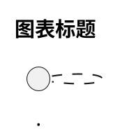

# PlantUML 流程图编写指南

本指南帮助 AI agent 学会编写 PlantUML 源文件并将其编译为 PNG 图片。

## 编译命令

系统已配置 `plantuml` 命令：

```bash
# 编译单个文件
plantuml diagram.puml

# 编译目录下所有 .puml 文件
plantuml *.puml

# 指定输出目录
plantuml -o output_dir diagram.puml

# 指定输出格式
plantuml -tpng diagram.puml   # PNG（默认）
plantuml -tsvg diagram.puml   # SVG
plantuml -tpdf diagram.puml   # PDF
```

> 注：`plantuml` 是 `java -jar /path/to/plantuml.jar` 的别名，或是配置好的plantuml的可执行程序命令

---

## 文件结构规范

### 基本结构

每个 PlantUML 文件必须包含以下结构：



### 头部配置说明

| 配置项 | 推荐值 | 说明 |
|--------|--------|------|
| `defaultFontName` | "PingFang SC" | 中文友好字体，macOS 使用 |
| `dpi` | 200 | 输出分辨率 |
| `scale` | 1 - 2 | 图像缩放比例（2是200%） |

**Linux 系统字体替代**：
- "Noto Sans CJK SC"
- "WenQuanYi Micro Hei"
- "Arial"（无中文需求时）

---

