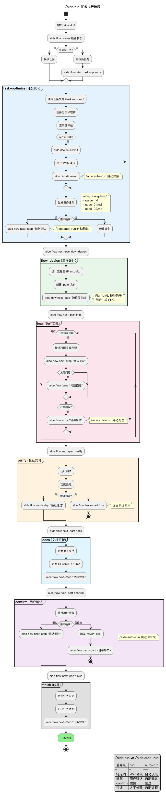
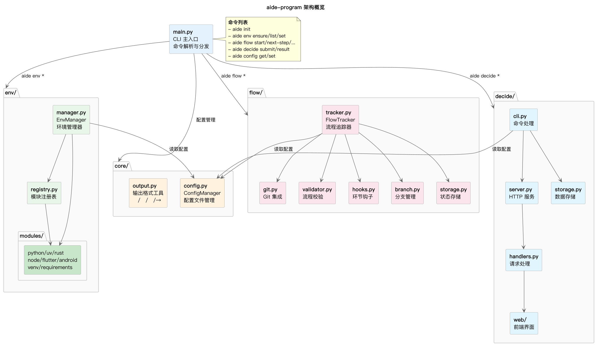

# Aide

[](https://opensource.org/licenses/Apache-2.0)
[](https://www.python.org/)

**面向 LLM 驱动开发的工作流工具** - 让 AI 辅助开发更加高效可控。

Aide 是一套为 Claude Code 设计的工作流辅助体系，通过结构化的任务管理、进度追踪和交互式决策，让 AI 辅助开发更加高效可控。

## 核心特性

- **任务进度追踪** - 自动记录开发进度，与 Git 深度集成
- **环境智能检测** - 支持 Python/Node/Rust/Flutter 等多种环境
- **交互式决策** - Web 界面处理待定项确认，让 AI 遵循你的选择
- **渐进式披露** - 按需加载信息，避免上下文过载
- **Claude Code 插件** - 8 个斜杠命令 + 5 个技能定义
- **确定性封装** - 工具调用产生确定性输出
- **信息隔离** - Commands 定义流程，Skills 定义工具用法

## 项目结构

```
agent-aide/
├── aide-program/          # 核心 CLI 工具（Python）
│   ├── aide/              # 源码
│   │   ├── core/          # 配置管理
│   │   ├── env/           # 环境检测
│   │   ├── flow/          # 流程追踪
│   │   └── decide/        # 待定项确认
│   └── bin/               # 可执行脚本
├── aide-marketplace/      # Claude Code 插件市场
│   └── aide-plugin/       # Aide 插件
│       ├── commands/      # 斜杠命令（8 个）
│       └── skills/        # 技能定义（5 个）
└── docs/                  # 项目文档
```

## 子项目

| 项目 | 路径 | 说明 | 技术栈 |
|------|------|------|--------|
| aide-program | `aide-program/` | 核心命令行工具，提供环境检测、流程追踪、待定项确认 | Python 3.11+ |
| aide-plugin | `aide-marketplace/aide-plugin/` | Claude Code 插件，提供工作流命令和技能 | Markdown |

## 架构概述

```
┌─────────────────────────────────────────────────────────┐
│                    Claude Code                          │
├─────────────────────────────────────────────────────────┤
│  aide-plugin                                            │
│  ├── Commands (定义"做什么")                            │
│  │   └── /aide:run, /aide:setup, /aide:docs...         │
│  └── Skills (定义"怎么做")                              │
│      └── aide, env-config, readme-templates...          │
├─────────────────────────────────────────────────────────┤
│  aide-program (CLI)                                     │
│  ├── env/    环境检测                                   │
│  ├── flow/   流程追踪 + Git 集成                        │
│  └── decide/ 待定项确认 (Web UI)                        │
└─────────────────────────────────────────────────────────┘
```

## 核心设计原则

| 原则 | 说明 |
|------|------|
| **渐进式披露** | 信息按需加载，避免上下文过载 |

---

## 快速开始

### 安装

```bash
git clone https://github.com/sayurinana/agent-aide.git
cd agent-aide/aide-program
uv venv .venv && source .venv/bin/activate
uv pip install -r requirements.txt

# linux下要把 /path/to/agent-aide/aide-program/bin 放进PATH
# Win下要把 D:\path\to\agent-aide\aide-program\bin\for_win-git-bash 放进PATH
```

### 初始化

```bash
# 在你的项目目录中
aide init
```

### 配置 Claude Code 插件

```bash
cd /path/to/agent-aide

# 进入claude后交互式操作
claude

# 在claude cli里输入 /plugin 根据引导信息完成安装
# 本地插件市场路径为 ./aide-marketplace
/plugin
```

---

## 命令使用指南

Aide 提供 8 个斜杠命令，覆盖开发工作流的各个环节。

### 命令体系概览



### 使用场景对照表

| 场景 | 推荐命令 | 说明 |
|------|----------|------|
| 首次使用/环境问题 | `/aide:setup` | 环境配置和检测 |
| 了解项目结构 | `/aide:load` | 载入项目认知 |
| 生成项目文档 | `/aide:docs` | 创建 LLM 友好的项目文档 |
| 执行开发任务 | `/aide:run` | 核心工作流命令 |
| 全自动执行 | `/aide:auto-run` | 减少交互的自动模式 |
| 生成 README | `/aide:readme` | 生成项目 README |
| 生成用户文档 | `/aide:user-docs` | 面向最终用户的文档 |
| 生成流程图 | `/aide:user-graph` | 可视化项目架构 |

### 典型工作流

#### ennnnn

> 其他内容都是AI生成的，没啥时间了，过几天就考试了，暂时就先做到这里吧，

> 其实这里下面例子挺潦草的，就这样吧先，
> 
> 本来想放一个写个小游戏的demo仓库的，暂时没时间了，
>
> 可以看看现在这个仓库的历史提交和分支提交

对于已有基础成果的项目，在项目目录下执行初始化

```bash
aide init
```

然后其他的就不需要自己执行shell命令了，进claude操作

```bash
claude --dangerously-skip-permissions
```

```bash
# 进了claude cli之后，

# 创建项目文档（面向LLM专用的）
/aide-plugin:docs

# 项目文档建好后先 /exit 退出
# 重新进然后载入项目文档
/aide-plugin:load

# 有什么想做的事，写在 task-now.md 里 （这个文件路径可以改，去看.aide/config.toml）
# 可以去看一下 .aide/config.toml 找到[decide]把url换成一个能访问的地方
# 任务写好之后
/aide-plugin:run

# 如果跑到中途上下文超了触发压缩了，直接Esc然后/exit ，重新进来，load 再 run

```

#### 新项目入门

```
/aide:setup  →  /aide:docs  →  /aide:load
   │               │               │
   ▼               ▼               ▼
 环境配置       项目文档       载入认知
```

1. `/aide:setup` - 检测并修复开发环境
2. `/aide:docs` - 生成项目文档（`.aide/project-docs/`）
3. `/aide:load` - 载入项目认知，了解项目结构

#### 任务执行流程

```
/aide:run
    │
    ├── task-optimize (任务准备)
    │   ├─ 任务分析与优化
    │   └─ 待定项处理
    │
    ├── flow-design (流程设计)
    │   └─ 创建 PlantUML 流程图
    │
    ├── impl (迭代实现)
    │   └─ 代码编写与测试
    │
    ├── verify (验证交付)
    │   └─ 功能验证与测试
    │
    ├── docs (文档更新)
    │   └─ 更新相关文档
    │
    └── finish (收尾)
        └─ 任务归档
```

#### 文档维护流程

```
/aide:readme     /aide:user-docs     /aide:user-graph
     │                  │                   │
     ▼                  ▼                   ▼
  README.md         用户文档           流程图
```

---

## 深入了解

### 流程图索引

所有流程图位于 `docs/graph-guide/` 目录：

#### aide-program（6 个）

| 流程图 | 说明 |
|--------|------|
|  | **整体架构** - 系统架构和模块关系 |
| [main.png](docs/graph-guide/aide-program/main.png) | CLI 主入口流程 |
| [env.png](docs/graph-guide/aide-program/env.png) | 环境检测流程 |
| [flow.png](docs/graph-guide/aide-program/flow.png) | 流程追踪核心流程 |
| [decide.png](docs/graph-guide/aide-program/decide.png) | 待定项确认流程 |
| [branch.png](docs/graph-guide/aide-program/branch.png) | 分支管理流程 |

#### aide-marketplace（3 个）

| 流程图 | 说明 |
|--------|------|
| [guide.png](docs/graph-guide/aide-marketplace/guide.png) | 插件架构和组件关系 |
| [commands.png](docs/graph-guide/aide-marketplace/commands.png) | 核心命令执行流程 |
| [skills.png](docs/graph-guide/aide-marketplace/skills.png) | 技能体系和触发机制 |

#### project-config-docs（1 个）

| 流程图 | 说明 |
|--------|------|
| [guide.png](docs/graph-guide/project-config-docs/guide.png) | 配置体系导航图 |

> 查看完整流程图目录：[docs/graph-guide/](docs/graph-guide/)

### 详细文档

| 文档 | 路径 | 说明 |
|------|------|------|
| 系统概述 | [docs/reference/aide-overview.md](docs/reference/aide-overview.md) | Aide 系统整体介绍 |
| 斜杠命令指南 | [docs/reference/01-自定义斜杠命令指南.md](docs/reference/01-自定义斜杠命令指南.md) | 命令开发指南 |
| 技能指南 | [docs/reference/02-技能指南.md](docs/reference/02-技能指南.md) | Skill 开发指南 |
| 插件指南 | [docs/reference/03-插件指南.md](docs/reference/03-插件指南.md) | 插件开发指南 |
| 插件市场指南 | [docs/reference/04-插件市场指南.md](docs/reference/04-插件市场指南.md) | 市场配置指南 |


---

## 贡献指南

欢迎为 Aide 做贡献！

### 开发环境

```bash
git clone https://github.com/sayurinana/agent-aide.git
cd agent-aide/aide-program
uv venv .venv && source .venv/bin/activate
uv pip install -r requirements.txt
```

### 提交规范

```
<type>(<scope>): <subject>

# type: feat/fix/docs/style/refactor/test/chore
# 示例: feat(flow): add branch management
```

### PR 检查清单

- [ ] 代码通过所有测试
- [ ] 更新了相关文档
- [ ] 提交信息格式正确

---

## 许可证

本项目采用 [Apache License 2.0](LICENSE) 许可证。

---

**Made with Claude Code**
