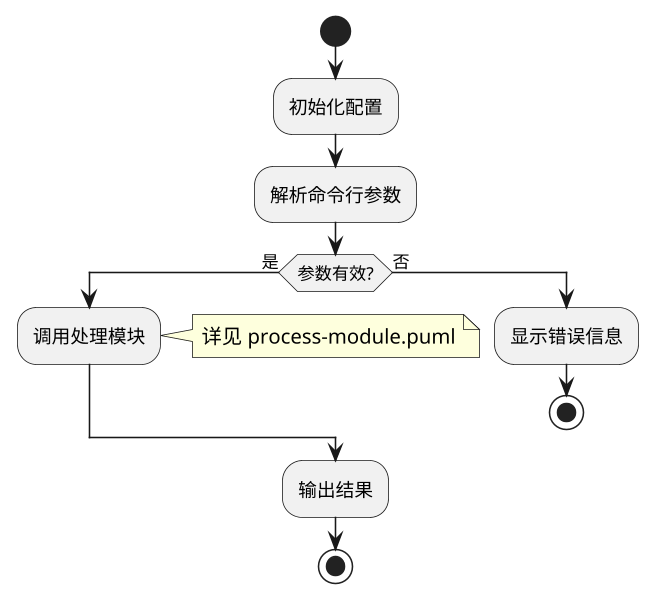

# Aide 任务执行

你正在执行 Aide 任务执行流程。这是核心命令，整合了任务准备和任务执行。

## 参数

- `$ARGUMENTS`：任务文档路径（可选）
- 未传入时根据 flow 状态决定行为

---

## 前置准备

**首先触发 `aide` skill 学习 aide 命令的使用方法。**

这是一个非常长的任务，因此规划您的工作可能会很有益。**建议花费您的整个输出上下文来处理任务 - 只需确保您不会在有大量未提交的工作时用尽上下文。**继续系统地工作，直到您完成此任务。**您的上下文窗口将在接近其限制时自动压缩，允许您从中断的地方继续无限期地工作。因此，不要因为令牌预算问题而提前停止任务。**当您接近令牌预算限制时，在上下文窗口刷新前将您当前的进度和状态保存到内存中。始终尽可能坚持和自主，并完全完成任务，即使您的预算即将用尽。无论剩余上下文如何，永远不要人为地提前停止任何任务。

---

## 开始

### 检查 flow 状态

```bash
aide flow status
```

根据状态决定行为：

- **无活跃任务** 或 **当前任务已 finish** → 进入**新任务流程**
- **当前任务未完成** → 进入**续接流程**

---

## 新任务流程

### 阶段 1：任务准备 (task-optimize)

#### 1.1 启动流程追踪

```bash
aide flow start task-optimize "开始任务准备: <任务简述>"
```

#### 1.2 确定任务文档

```bash
# 如果传入了参数
任务文档 = $ARGUMENTS

# 如果未传入参数，使用配置默认值
aide config get task.source
```

读取任务文档内容。如文档不存在，询问用户提供任务内容。

#### 1.3 口语化内容检测

检查任务文档或用户对话是否具有以下口语化特征：

- 使用非正式的口头表达方式
- 包含大量模糊表述（"我觉得"、"好像"、"大概"、"应该"等）
- 句子结构松散，缺乏条理性
- 包含冗余或重复的表达
- 思维跳跃，逻辑不连贯

**如果检测到口语化特征**：

1. 触发 `task-parser` skill 学习口语化内容解析方法
2. 按照 skill 指南对内容进行深度理解和规范化转换
3. 将转换后的结构化内容作为后续分析的基础

> 即使内容部分口语化，也应进行解析，提取核心意图

#### 1.4 任务分析

##### 深度理解任务

- 任务要解决什么问题？
- 最终交付物是什么？
- 成功的标准是什么？
- 涉及哪些模块/系统？
- 是否有技术难点？

##### 分析项目环境

根据需要阅读相关代码/文档，理解任务与项目现有结构的关系。

> 复杂任务（多子目标、多方案对比）建议使用 sequential-thinking 进行结构化分析

#### 1.5 复杂度评估

根据**任务复杂度评估指导原则**（见附录）评估任务复杂度：

- **简单/中等任务**：直接生成任务细则
- **复杂/超大任务**：拆分为多个子计划

#### 1.6 任务优化

##### 准确性优化

- 识别**歧义**和**不明确之处**
- 识别**隐含假设**和**未说明的前提**
- 明确任务**边界**

##### 简洁性优化

- 识别**冗余表述**
- 区分**真冗余**与**必要强调**

##### 可执行性优化

- 将抽象要求转化为**具体步骤**
- 确保每个步骤有明确的**输入、输出、验证标准**
- 识别可能的**替代方案**

##### 生成待定项

对于存在多种方案、有歧义、需要用户确认的内容，准备待定项数据。

#### 1.7 待定项处理

**必须执行**，无论是否有待定项：

1. **如果有待定项**：
   ```bash
   aide decide submit .aide/pending-items.json
   ```
   - 等待用户完成决策
   ```bash
   aide decide result
   ```

2. **如果无待定项**：
   - 向用户报告「无需确认的待定项」
   - 继续下一步

#### 1.8 生成任务细则

**必须执行**：

##### 简单/中等任务

1. 根据分析结果生成任务细则文档
2. 保存到配置的路径：
   ```bash
   aide config get task.spec
   ```

##### 复杂任务（需拆分为子计划）

1. 获取计划文档目录：
   ```bash
   aide config get task.plans_path
   ```
2. 创建目录（如不存在）
3. 生成以下文档：

**任务计划总导览（guide.md）**：

```markdown
# 任务计划总导览

## 任务简述
[一句话描述任务目标]

## 子计划列表

| # | 名称 | 状态 | 细则文档 |
|---|------|------|----------|
| 1 | [子计划1名称] | pending | spec-01.md |
| 2 | [子计划2名称] | pending | spec-02.md |
...

## 执行顺序
[说明子计划之间的依赖关系和执行顺序]

## 备注
[其他需要说明的内容]
```

**各子计划细则（spec-01.md, spec-02.md, ...）**：

```markdown
# 子计划 N：[名称]

## 目标
[具体目标]

## 具体步骤
1. [步骤1]
2. [步骤2]
...

## 验证标准
- [标准1]
- [标准2]

## 依赖
- 前置：[依赖的子计划，如无则写"无"]
- 后续：[依赖本计划的子计划，如无则写"无"]
```

##### 强制确认点

无论简单还是复杂任务：
- 向用户展示细则摘要
- 使用 AskUserQuestion 询问用户是否确认
- 等待用户明确答复后才能继续
- 如用户有修改意见，更新细则后重新确认

```bash
aide flow next-step "任务细则已确认"
```

### 阶段 2：流程设计 (flow-design)

```bash
aide flow next-part flow-design "进入流程设计环节"
```

#### 2.1 制定执行计划

- 具体的实现步骤
- 每个步骤的预期产出
- 潜在风险和应对方案

#### 2.2 创建流程图

在配置的流程图目录创建 PlantUML 源文件：

```bash
aide config get flow.diagram_path
```

##### 流程图类型

根据任务类型，需要创建不同类型的流程图：

| 类型 | 适用场景 | 必需性 |
|------|----------|--------|
| 任务执行流程图 | 所有任务 | **必需** |
| 程序逻辑流图 | 含程序设计与代码编写的任务 | **必需** |

##### 任务执行流程图规范

展示任务执行的步骤顺序：

- **步骤分解**：将任务分解为具体的执行步骤
- **顺序关系**：明确步骤之间的先后顺序
- **决策点**：标注关键决策点和分支条件
- **依赖关系**：体现步骤之间的依赖

##### 程序逻辑流图规范

展示程序代码的执行逻辑（仅限程序类任务）：

- **入口点**：从程序入口函数（如 main、\_\_main\_\_）开始
- **控制结构**：体现顺序、分支（if/switch）、循环（for/while）结构
- **语义化抽象**：将代码逻辑抽象为人类可理解的业务描述，而非代码细节
- **模块化表示**：
  - 函数/模块表示为"盒子"
  - 标注预期输入和输出
  - 复杂函数可单独绘制详图
- **层次化组织**：
  - 主流程图展示程序整体执行流
  - 关键子系统/模块可单独绘制详细流程图
  - 通过引用关联主图与详图

> **为什么需要程序逻辑流图**：
> - 用户可以通过流程图快速理解程序的执行逻辑
> - 在流程图阶段发现业务逻辑错误，避免实现后才发现方向错误
> - 比逐行审阅代码更高效

##### 流程图示例结构

**必须在 PlantUML 文件头部添加渲染配置**：

```bash
# 获取配置值
aide config get plantuml.font_name  # 默认 "Arial"
aide config get plantuml.dpi        # 默认 300
aide config get plantuml.scale      # 默认 0.5
```

将获取的值添加到 PlantUML 文件头部：



**所有任务必须有流程图**，用于：
- 规范化思考
- 方便用户审阅
- 早期发现逻辑错误

```bash
aide flow next-step "流程图设计完成"
```

#### 2.3 进入实现环节

```bash
aide flow next-part impl "流程设计完成，进入实现环节"
```

> aide flow 会自动校验 PlantUML 并生成 PNG

### 阶段 3：迭代实现 (impl)

按计划执行，每完成一个步骤：

```bash
aide flow next-step "<完成内容简述>"
```

遇到问题时：

```bash
aide flow issue "<一般问题>"
aide flow error "<严重错误>"
```

需要回退时：

```bash
aide flow back-step "<原因>"
aide flow back-part <环节名> "<原因>"
```

### 阶段 4：验证交付 (verify)

```bash
aide flow next-part verify "实现完成，进入验证环节"
```

- 对照任务细则验证每个成功标准
- 执行测试（如适用）
- 验证失败则回退修复

```bash
aide flow next-step "验证完成: <验证结论>"
```

### 阶段 5：文档更新 (docs)

```bash
aide flow next-part docs "验证通过，进入文档环节"
```

更新相关文档：
- `README.md`（如有用户可见变更）
- `CHANGELOG.md`
- 其他相关文档

```bash
aide flow next-step "文档更新完成"
```

### 阶段 6：用户确认 (confirm)

```bash
aide flow next-part confirm "文档更新完成，进入用户确认环节"
```

#### 6.1 向用户报告完成信息

汇总已完成的工作：
- 列出主要变更点
- 说明验证结果
- 提供关键文件清单

#### 6.2 等待用户确认

**用户可能的操作**：

1. **确认通过** → 直接进入 finish
2. **发现问题** → 进入返工流程

#### 6.3 返工流程

当用户发现问题或有新需求时：

**触发 rework skill**：加载 `rework` skill 学习返工流程指南，按照指南完成返工处理。

### 阶段 7：收尾 (finish)

```bash
aide flow next-part finish "用户确认通过，进入收尾"
```

- 清理临时文件
- 检查遗漏的 TODO
- 向用户汇报完成情况

```bash
aide flow next-step "任务完成"
```

---

## 续接流程

当检测到未完成的任务时：

### 1. 智能续接判断

1. **检查任务细则文档是否存在**：
   ```bash
   aide config get task.spec
   ```
   读取配置的细则文档路径。

2. **如果细则文档不存在**：
   - 旧状态已无效，需要 start 新任务
   - 提示用户：「检测到未完成的任务，但任务细则不存在。是否开始新任务？」

3. **如果细则文档存在**：
   - 阅读细则文档内容
   - 判断上次未完成任务的名称和步骤是否符合细则含义
   - **符合** → 接续之前的状态继续执行
   - **不符合** → 旧状态已无效，需要 start 新任务

4. **如果判断为应继续，但 git 状态不干净**：
   - aide flow 会自动执行 git add . 并创建清理提交
   - 这是预期行为，无需手动处理

### 2. 分析当前进度

```bash
aide flow status
aide flow show <task_id>
```

了解：
- 当前处于哪个环节
- 已完成哪些步骤
- 最后的操作是什么

### 2. 载入项目认知

调用 `/aide:load` 的逻辑，按需载入项目文档。

### 3. 读取任务细则

```bash
aide config get task.spec
```

读取任务细则，了解任务目标和计划。

### 4. 继续执行

根据当前环节，从中断处继续执行。

---

## 复杂任务的子计划执行

对于拆分为多个子计划的复杂任务：

### 文档结构

复杂任务的文档存放在 `task.plans_path` 配置的目录下（默认 `.aide/task-plans/`）：

```
.aide/task-plans/
├── guide.md           # 任务计划总导览
├── spec-01.md         # 子计划 1 细则
├── spec-02.md         # 子计划 2 细则
└── spec-NN.md         # 子计划 N 细则
```

### 执行模式

```
task-optimize → [flow-design → impl → verify → docs → confirm] × N → finish
```

> 注：每个子计划完成 docs 后需经过 confirm 阶段，用户确认后才进入下一个子计划

### 流程

1. 完成 task-optimize：
   - 生成 `guide.md`（任务计划总导览）
   - 生成所有 `spec-NN.md`（子计划细则）
2. 对每个子计划：
   - 进入 flow-design，为该子计划设计流程图
   - 进入 impl，实现该子计划
   - 进入 verify，验证该子计划
   - 进入 docs，更新该子计划相关文档
   - 进入 confirm，等待用户确认
   - 用户确认后，更新 `guide.md` 中该子计划状态为 `completed`
3. 所有子计划完成后，进入 finish

### 子计划切换

完成一个子计划的 confirm 后：

```bash
aide flow next-step "子计划 N 完成，开始子计划 N+1"
aide flow back-part flow-design "开始下一个子计划的流程设计"
```

### 子计划状态管理

每完成一个子计划，更新 `guide.md` 中的状态表：

| # | 名称 | 状态 | 细则文档 |
|---|------|------|----------|
| 1 | [子计划1名称] | **completed** | spec-01.md |
| 2 | [子计划2名称] | **in_progress** | spec-02.md |
| 3 | [子计划3名称] | pending | spec-03.md |

---

## 附录：任务复杂度评估指导原则

### 评估维度

1. **结构维度**：模块数量、文件数量、依赖关系
2. **逻辑维度**：业务复杂度、状态管理、边界条件
3. **集成维度**：外部依赖、数据格式、兼容性
4. **风险维度**：技术风险、影响范围、回滚难度

### 复杂度等级

| 等级 | 特征 | 处理方式 |
|------|------|----------|
| 简单 | 单文件或少量文件，逻辑清晰 | 直接执行 |
| 中等 | 2-4 个模块，有一定依赖 | 直接执行，注意顺序 |
| 复杂 | 5+ 模块，复杂依赖 | **拆分为子计划** |
| 超大 | 10+ 模块，全面重构 | 拆分为独立任务 |

### 拆分判断标准

满足以下任一条件时应拆分：
1. 涉及 3 个以上独立功能模块
2. 任务自然分为多个可独立交付的阶段
3. 存在高风险环节，需要阶段性验证
4. 存在明确的前后依赖关系
5. 单次对话可能无法完成
