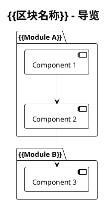

# Aide 用户流程图生成

你正在执行 Aide 用户流程图生成流程。这个命令帮助用户创建面向用户的长期维护流程图系统。

此命令支持**分步执行**和**接续执行**，适用于大型项目。

---

## 前置准备

**首先检查项目文档是否存在。**

```bash
aide config get docs.path
```

如果项目文档目录（`.aide/project-docs/`）不存在：

> 用户流程图依赖项目文档来了解项目结构。建议先执行 `/aide:docs` 和 `/aide:load`。

使用 AskUserQuestion 询问：
- **先执行 /aide:docs**（推荐）
- **继续（基于代码分析）**

---

## 开始

### 检查计划文件

```bash
aide config get user_docs.graph_plan_path
```

读取配置的计划文件路径，检查文件是否存在。

**根据计划文件状态决定流程**：

- **计划文件不存在** → 进入**分析和计划阶段**
- **计划文件存在** → 进入**接续执行阶段**

---

## 分析和计划阶段

当 `docs/graph-guide/plan.md` 不存在时执行此流程。

### 1. 加载项目文档

读取 `.aide/project-docs/` 下的项目文档：

1. 读取总导览（`README.md`）获取：
   - 项目类型（文档/程序/混合）
   - 子项目/模块列表
   - 技术栈信息

2. 阅读相关区块文档了解详细结构

### 2. 区块划分

**划分原则**（与项目文档不同）：

- 目标是呈现**整体形式**
- 按**业务逻辑**或**独立开发项目**划分
- 不追求深度全覆盖

**区块类型**：

| 类型 | 说明 | 典型内容 |
|------|------|----------|
| 库项目 | 独立的库/工具包 | API 设计、核心逻辑 |
| 应用 | 可运行的程序 | 启动流程、业务逻辑 |
| 前端 | UI 相关 | 组件结构、数据流 |
| 文档 | 纯文档项目 | 内容导航、学习路径 |

### 3. 复杂度分析

对每个区块评估：

| 复杂度 | 特征 | 预估步骤数 |
|--------|------|-----------|
| 低 | 单模块，逻辑简单 | 2-3 |
| 中 | 多模块，有交互 | 4-6 |
| 高 | 复杂系统，多层次 | 7+ |

### 4. 生成计划文档

在 `docs/graph-guide/` 目录创建 `plan.md`：

```markdown
# 用户流程图编写计划

## 项目概述

{{基于项目文档的简要描述}}

## 区块划分

| # | 区块名称 | 类型 | 复杂度 | 状态 |
|---|----------|------|--------|------|
{{BLOCKS_TABLE}}

## 执行步骤

### 区块 1: {{BLOCK_1_NAME}}

- [ ] 步骤 1.1: 分析模块结构
- [ ] 步骤 1.2: 编写 guide.puml
- [ ] 步骤 1.3: 编写 {{module}}.puml
...

### 区块 2: {{BLOCK_2_NAME}}

- [ ] 步骤 2.1: ...
...

## 当前进度

- 当前区块：0（未开始）
- 当前步骤：-
- 最后更新：{{TIMESTAMP}}

## 备注

（执行过程中的记录）
```

### 5. 创建目录结构

```bash
aide config get user_docs.graph_path
```

创建流程图目录和子目录：

```
docs/graph-guide/
├── plan.md
└── {{block_name}}/      # 每个区块一个目录
```

### 6. 用户确认

> 流程图编写计划已生成。
>
> **区块划分**：
> {{BLOCKS_SUMMARY}}
>
> **预估步骤**：共 {{TOTAL_STEPS}} 步
>
> 是否开始执行？

**选项**：
- **开始执行**（推荐）
- **调整计划**
- **稍后执行**

如选择开始执行，进入步骤执行流程。

---

## 接续执行阶段

当 `docs/graph-guide/plan.md` 存在时执行此流程。

### 1. 读取计划文档

解析 plan.md 获取：
- 区块列表和状态
- 当前进度（区块和步骤）
- 历史备注

### 2. 显示进度

> **流程图编写进度**
>
> 当前区块：{{CURRENT_BLOCK}}
> 当前步骤：{{CURRENT_STEP}}
> 已完成步骤：{{COMPLETED_STEPS}}/{{TOTAL_STEPS}}
> 上次更新：{{LAST_UPDATE}}

### 3. 确认继续

使用 AskUserQuestion：

> 是否从当前进度继续执行？

**选项**：
- **继续执行**（推荐）
- **查看计划详情**
- **重新开始**（清空进度）

---

## 步骤执行流程

### 执行单个步骤

对于每个步骤：

1. **显示当前任务**：
   > 正在执行：{{STEP_DESCRIPTION}}

2. **执行步骤**：
   - 分析相关代码/文档
   - 生成/更新 puml 文件

3. **更新计划文档**：
   - 标记步骤完成
   - 更新当前进度
   - 记录时间戳

4. **保存产出**：
   - 写入 puml 文件
   - 调用 PlantUML 生成 PNG（如配置）

### 步骤间询问

每完成一个步骤后询问：

> 步骤 {{STEP_ID}} 已完成。
>
> 是否继续下一步？

**选项**：
- **继续**（推荐）
- **查看产出**
- **暂停（保存进度）**

如选择暂停，保存进度后结束本次执行。

---

## 流程图内容规范

### 总导览流程图（guide.puml）

每个区块的 guide.puml 应包含：
- 模块概览
- 调用关系
- 数据流向

### 详细流程图（module.puml）

#### 不含程序的项目

- 内容导航图
- 学习路径图
- 概念关系图

#### 含程序的项目

参考 `/aide:run` 中的程序逻辑流图规范：

1. **入口点**：从程序入口开始
2. **控制结构**：体现顺序、分支、循环
3. **语义化抽象**：人类可理解的业务描述
4. **模块化表示**：
   - 函数/模块表示为"盒子"
   - 标注输入输出
5. **层次化组织**：
   - 主流程图 + 详细子图

### PlantUML 模板



---

## 目录结构

最终生成的目录结构：

```
docs/graph-guide/
├── plan.md              # 计划和进度文档
├── guide.puml           # 总导览流程图（可选）
├── {{block-1}}/         # 区块 1
│   ├── guide.puml       # 区块导览
│   ├── module-a.puml    # 模块 A 流程图
│   └── module-b.puml    # 模块 B 流程图
├── {{block-2}}/         # 区块 2
│   ├── guide.puml
│   └── ...
└── ...
```

---

## 配置项

| 配置项 | 默认值 | 说明 |
|--------|--------|------|
| `user_docs.graph_path` | `docs/graph-guide` | 流程图目录路径 |
| `user_docs.graph_plan_path` | `docs/graph-guide/plan.md` | 计划文件路径 |

---

## 注意事项

1. **分步执行**：大型项目建议分多次对话完成
2. **进度持久化**：进度保存在 plan.md，可随时接续
3. **PNG 生成**：需要配置 PlantUML（参考 `[plantuml]` 配置）
4. **与项目文档关联**：依赖项目文档了解项目结构
5. **用户参与**：关键决策需用户确认
