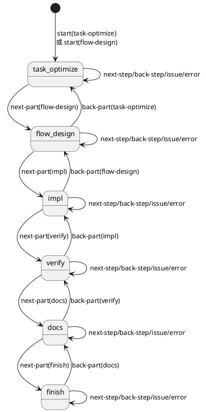

# 流程校验规则（FlowValidator）

## 一、设计目标

流程校验的目标是：

- 防止“跳过环节”造成关键步骤遗漏
- 允许受控回退（返工有记录）
- 支持通过配置 `flow.phases` 调整环节名称与顺序

## 二、环节来源与基础约束

### 2.1 phases 来源

`phases` 必须来自配置 `flow.phases`（见 `aide-program/docs/formats/config.md`）。

### 2.2 基础约束

- phases 列表不能为空
- phases 中的环节名必须唯一
- 当前状态 `current_phase` 必须属于 phases

当以上条件不满足时，返回错误并提示用户修正配置或重新 start。

## 三、动作级校验

### 3.1 start 校验

允许：

- `start <phase>`：`phase` ∈ phases

建议额外约束（可选，但需在实现前确认）：

- 若 phase 不是 phases[0]，输出 `⚠` 提醒“从中间环节开始”

### 3.2 next-step / back-step / issue / error

前置条件：

- 状态文件存在（已 start）
- `current_phase` 合法

行为：

- 不改变 phase（phase 保持 current_phase）
- 仅记录一次历史

### 3.3 next-part 校验

前置条件：

- 状态文件存在（已 start）
- `to_phase` ∈ phases

允许：

- `to_phase` 必须等于 phases 中 `current_phase` 的**相邻下一项**

禁止：

- 跳跃（例如 `flow-design → verify`）
- 原地（例如 `impl → impl`）

### 3.4 back-part 校验

前置条件：

- 状态文件存在（已 start）
- `to_phase` ∈ phases

允许：

- `to_phase` 必须位于 `current_phase` 之前（可回退到任意之前环节）

禁止：

- 前进（例如 `flow-design → impl` 使用 back-part）
- 原地（例如 `verify → verify`）

## 四、默认 phases 的状态机（示例）

当 `flow.phases = ["task-optimize","flow-design","impl","verify","docs","finish"]` 时，推荐状态机如下：

> 注：示例图允许从 `flow-design` start，以兼容“跳过 prep 直接 exec”的场景；是否默认允许由实现选择，但必须在行为与提示上保持一致。

## 五、与 Hooks 的关系

部分校验属于“流程校验”，部分属于“环节特定校验”（Hooks）：

- 流程校验：只关心 phases 顺序与动作合法性（本文件）
- 环节特定校验：如离开 `flow-design` 时 PlantUML 校验、离开 `docs` 时 CHANGELOG 校验（见 `hooks.md`）
