# 步骤 002：aide-program - main.puml

## 元信息

| 属性 | 值 |
|------|-----|
| 状态 | pending |
| 所属区块 | aide-program |
| 流程图类型 | 模块图 |
| 预估工作量 | 中 |
| 依赖步骤 | step-001 |

## 任务描述

绘制 aide-program 的 CLI 主入口流程图，展示命令解析和处理器分发逻辑。

## 模块结构（已分析）

以下是执行本步骤所需的全部模块信息：

### 涉及文件

| 文件路径 | 职责 | 关键内容 |
|----------|------|----------|
| `aide-program/aide/main.py` | CLI 主入口 | 命令行解析、处理器分发（约 440 行） |
| `aide-program/aide/__main__.py` | 模块入口 | 调用 main() |

### 模块关系

```
__main__.py
  └→ main.py::main()
       ├→ argparse 解析命令行
       ├→ 根据命令分发到处理器：
       │    ├→ "init" → handle_init()
       │    ├→ "env" → handle_env_command()
       │    ├→ "flow" → handle_flow_command()
       │    ├→ "decide" → handle_decide_command()
       │    └→ "config" → handle_config_command()
       └→ 处理器执行并返回结果
```

### 数据流

```
命令行参数 → argparse 解析 → 命令识别 → 子命令解析 → 处理器调用 → 结果输出

示例：
"aide flow start task-optimize '开始任务'"
  → command="flow"
  → subcommand="start"
  → args=["task-optimize", "开始任务"]
  → handle_flow_command(args)
```

### 关键函数/类

| 名称 | 位置 | 说明 |
|------|------|------|
| `main()` | main.py | 主入口，创建 ArgumentParser |
| `handle_init()` | main.py | 处理 aide init |
| `handle_env_command()` | main.py | 处理 aide env * |
| `handle_flow_command()` | main.py | 处理 aide flow * |
| `handle_decide_command()` | main.py | 处理 aide decide * |
| `handle_config_command()` | main.py | 处理 aide config * |

### 命令结构

```
aide
├── init                    → handle_init()
├── env
│   ├── ensure [--runtime] [--modules] [--all] [-v]
│   ├── list
│   └── set <key> <value>
├── flow
│   ├── start <phase> <summary>
│   ├── next-step <summary>
│   ├── back-step <reason>
│   ├── next-part <phase> <summary>
│   ├── back-part <phase> <reason>
│   ├── back-confirm --key <key>
│   ├── issue <description>
│   ├── error <description>
│   ├── status
│   ├── list
│   └── show <task_id>
├── decide
│   ├── submit <file>
│   └── result
└── config
    ├── get <key>
    └── set <key> <value>
```

## 输出要求

- 文件：`aide-program/main.puml`
- 类型：活动图 (activity diagram)
- 内容要求：
  - [ ] 展示程序入口和命令行解析流程
  - [ ] 展示命令分发逻辑（switch/case 结构）
  - [ ] 展示各命令对应的处理器
  - [ ] 标注子命令解析层级

## PlantUML 模板

```plantuml
@startuml main
skinparam defaultFontName "PingFang SC"
skinparam dpi 300
scale 0.3

title aide CLI 主流程

' TODO: 基于上述模块结构绘制活动图

@enduml
```



## 执行记录

| 时间 | 操作 | 备注 |
|------|------|------|
| | | |
