# 步骤 005：aide-program - decide.puml

## 元信息

| 属性 | 值 |
|------|-----|
| 状态 | pending |
| 所属区块 | aide-program |
| 流程图类型 | 模块图 |
| 预估工作量 | 中 |
| 依赖步骤 | step-001 |

## 任务描述

绘制 aide-program 的待定项确认流程图，展示 submit → server → result 的完整交互流程。

## 模块结构（已分析）

以下是执行本步骤所需的全部模块信息：

### 涉及文件

| 文件路径 | 职责 | 关键内容 |
|----------|------|----------|
| `aide-program/aide/decide/cli.py` | CLI 处理 | submit/result 命令（134 行） |
| `aide-program/aide/decide/types.py` | 数据结构 | DecideItem, DecideResult 等（324 行） |
| `aide-program/aide/decide/storage.py` | 数据存储 | pending/result 文件管理（164 行） |
| `aide-program/aide/decide/server.py` | HTTP 服务 | DecideServer 类（271 行） |
| `aide-program/aide/decide/handlers.py` | 请求处理 | API 和静态资源（155 行） |
| `aide-program/aide/decide/daemon.py` | 后台服务 | 后台启动入口（48 行） |
| `aide-program/aide/decide/web/index.html` | 前端页面 | HTML 页面（50 行） |
| `aide-program/aide/decide/web/style.css` | 样式 | CSS 样式（345 行） |
| `aide-program/aide/decide/web/app.js` | 交互逻辑 | JavaScript 逻辑（321 行） |

### 模块关系

```
aide decide submit <file>
  └→ cli.py::handle_submit()
       ├→ storage.py::save_pending() 保存待定项
       ├→ daemon.py 启动后台服务
       └→ server.py::DecideServer
            ├→ handlers.py 处理请求
            │    ├→ GET /api/items → 返回待定项
            │    ├→ POST /api/submit → 接收决策
            │    └→ GET /* → 返回静态资源
            └→ web/* 前端资源
                 └→ 用户交互界面

aide decide result
  └→ cli.py::handle_result()
       └→ storage.py::load_result() 读取决策结果
```

### 数据流

```
提交流程：
JSON 文件 → cli.py 解析 → storage 保存 → daemon 启动服务
  → server 监听端口 → 用户访问 Web 界面 → 提交决策
  → handlers 处理 → storage 保存结果 → server 关闭

获取结果：
aide decide result → cli.py → storage.load_result() → 输出 JSON
```

### 关键函数/类

| 名称 | 位置 | 说明 |
|------|------|------|
| `handle_submit()` | cli.py | 处理 submit 命令 |
| `handle_result()` | cli.py | 处理 result 命令 |
| `DecideStorage` | storage.py | 数据文件管理 |
| `save_pending()` | storage.py | 保存待定项 |
| `load_result()` | storage.py | 读取决策结果 |
| `DecideServer` | server.py:26 | HTTP 服务器 |
| `start_daemon()` | server.py | 后台启动 |
| `DecideHandlers` | handlers.py | 请求处理器 |

### 数据格式

```json
// 待定项格式 (pending.json)
{
  "task": "任务简述",
  "source": "now-task.md",
  "items": [
    {
      "id": 1,
      "title": "问题标题",
      "context": "问题背景",
      "options": [
        {"value": "option_a", "label": "选项A", "score": 85, "pros": [], "cons": []},
        {"value": "option_b", "label": "选项B", "score": 70, "pros": [], "cons": []}
      ],
      "recommend": "option_a"
    }
  ]
}

// 决策结果格式 (result.json)
{
  "decisions": [
    {"id": 1, "chosen": "option_a", "note": "用户备注"}
  ]
}
```

## 输出要求

- 文件：`aide-program/decide.puml`
- 类型：序列图 (sequence diagram)
- 内容要求：
  - [ ] 展示 submit 完整流程（CLI → storage → daemon → server）
  - [ ] 展示用户与 Web 界面的交互
  - [ ] 展示 result 获取流程
  - [ ] 标注服务生命周期

## PlantUML 模板

```plantuml
@startuml decide
skinparam defaultFontName "PingFang SC"
skinparam dpi 300
scale 0.3

title aide decide 待定项确认流程

' TODO: 基于上述模块结构绘制序列图

@enduml
```



## 执行记录

| 时间 | 操作 | 备注 |
|------|------|------|
| | | |
